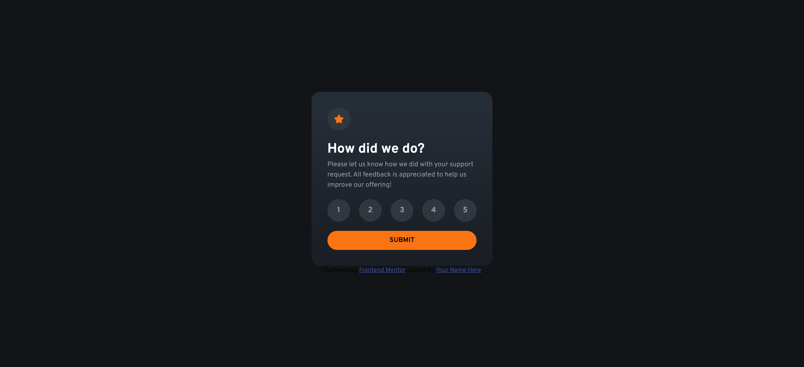
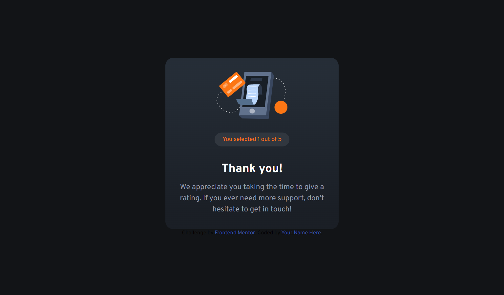
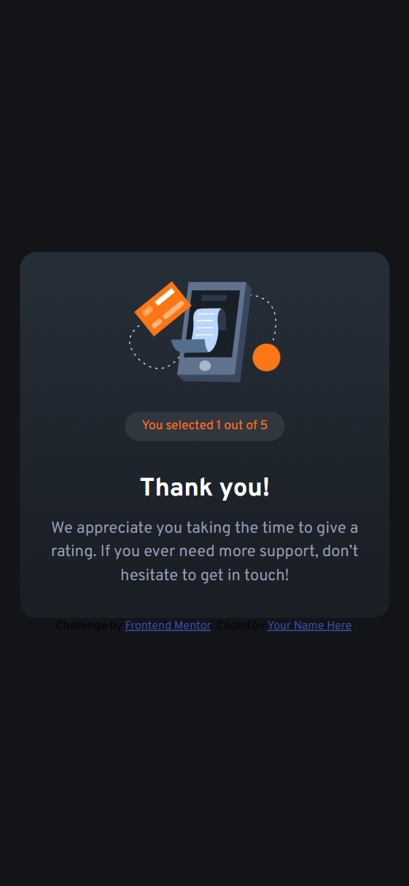
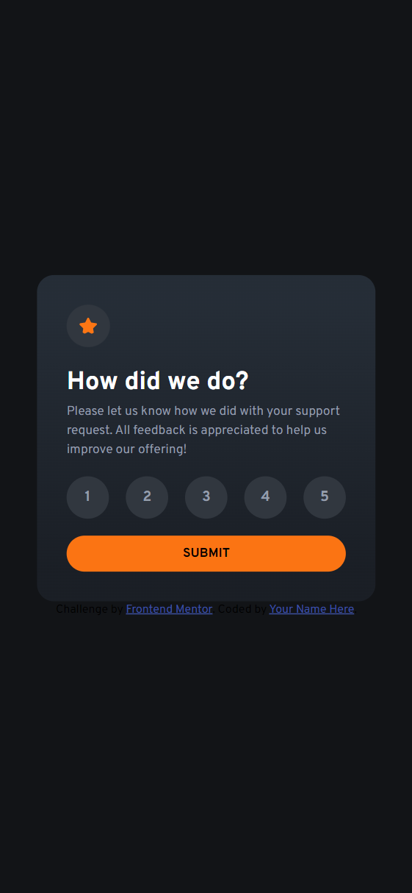

# Frontend Mentor - Interactive rating component solution

This is my solution to the [Interactive rating component challenge on Frontend Mentor](https://www.frontendmentor.io/challenges/interactive-rating-component-koxpeBUmI). Frontend Mentor challenges help you improve your coding skills by building realistic projects.

## Table of contents

- [Overview](#overview)
     - [The challenge](#the-challenge)
     - [Screenshot](#screenshot)
     - [Links](#links)
- [My process](#my-process)
     - [Built with](#built-with)
     - [What I learned](#what-i-learned)
     - [Continued development](#continued-development)
     - [Useful resources](#useful-resources)
- [Author](#author)
- [Acknowledgments](#acknowledgments)

## Overview

### The challenge

Users should be able to:

- View the optimal layout for the app depending on their device's screen size
- See hover states for all interactive elements on the page
- Select and submit a number rating
- See the "Thank you" card state after submitting a rating

### Screenshot

#### Desktop Views




#### Mobile Views




### Links

- Solution URL: [solution URL here](https://your-solution-url.com)
- Live Site URL: [live site URL here](https://your-live-site-url.com)

## My process

### Built with

- Semantic HTML5 markup
- CSS custom properties
- Flexbox
- CSS Grid

### What I learned

I learned how to use data selectors and change the value for the thank you state.

```html
<div class="rating-container">
	<button class="rank" aria-label="Rate 1" data-value="1">1</button>
	<button class="rank" aria-label="Rate 2" data-value="2">2</button>
	<button class="rank" aria-label="Rate 3" data-value="3">3</button>
	<button class="rank" aria-label="Rate 4" data-value="4">4</button>
	<button class="rank" aria-label="Rate 5" data-value="5">5</button>
</div>
```

```js
document.addEventListener('DOMContentLoaded', function () {
	const ratingButtons = document.querySelectorAll('.rank');
	const submitButton = document.getElementById('submit-button');
	const ratingState = document.getElementById('rating-state');
	const thankYouState = document.getElementById('thank-you-state');
	const selectedRatingSpan = document.querySelector('.rate');
	let selectedRating = 0;

	ratingButtons.forEach(button => {
		button.addEventListener('click', function () {
			// Remove active class from all buttons
			ratingButtons.forEach(btn => btn.classList.remove('active'));
			// Add active class to the clicked button
			this.classList.add('active');
			// Set the selected rating value
			selectedRating = this.getAttribute('data-value');
		});
	});

	submitButton.addEventListener('click', function () {
		if (selectedRating > 0) {
			// Update the rating in the thank you message
			selectedRatingSpan.textContent = selectedRating;
			// Hide the rating state and show the thank you state
			ratingState.classList.add('hidden');
			thankYouState.classList.remove('hidden');
			thankYouState.style.display = "grid"
		} else {
			alert('Please select a rating before submitting.');
		}
	});
});
```

### Continued development

I want to become more comfortable manipulating the DOM without hand holding.

### Useful resources

- [ChatGPT](https://chatgpt.com/c/4d3275c7-ab59-4697-98ff-c7544f3f2153) - Used for queries and small questions.

## Author

- Frontend Mentor - [@Ckola99](https://www.frontendmentor.io/profile/Ckola99)
- Twitter - [@KolaDev01](https://www.twitter.com/kolaDev01)

## Acknowledgments

No acknowledgements this time.
